<div align="center">

# PokerPlan

**Real-time Scrum planning poker. Share a link, vote in secret, reveal together, agree faster.**

[](https://github.com/rajak312/pokerplan/actions/workflows/ci.yml)


[](LICENSE)

**[Live demo](https://pokerplan.vercel.app)** · **[API docs](https://pokerplan-api.onrender.com/docs)** · [Report a bug](https://github.com/rajak312/pokerplan/issues)

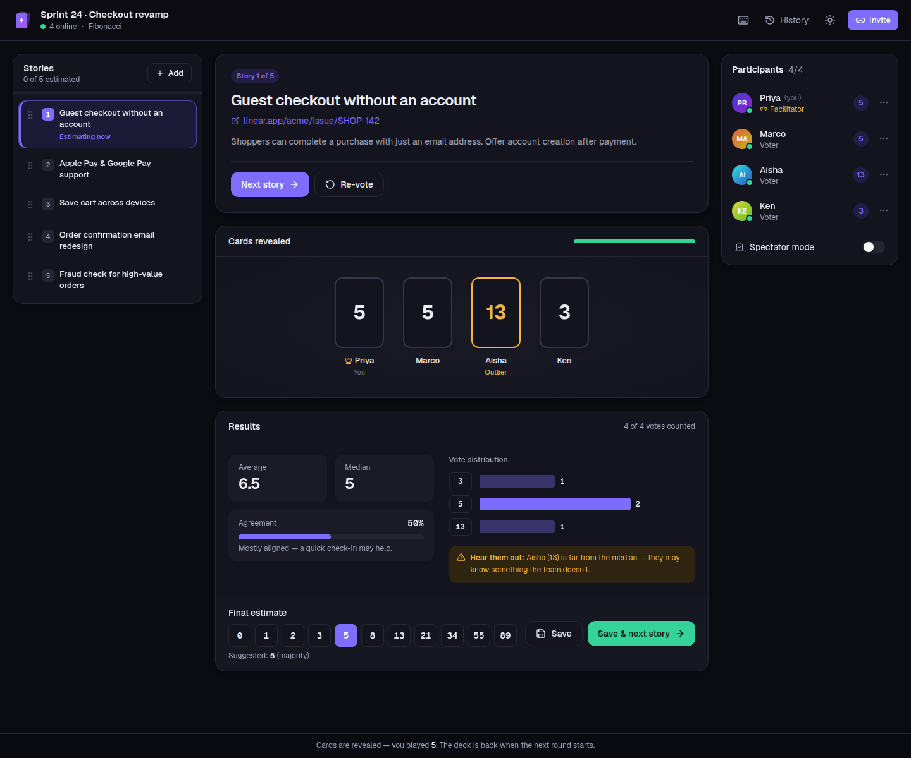

</div>

> The live demo runs on free tiers. If nobody has used it for a while, the API sleeps and the first
> connection takes ~30–60 s to wake it up (the UI says so while it waits).

---

## Contents

- [Features](#features)
- [Screenshots](#screenshots)
- [Architecture](#architecture)
- [Tech stack](#tech-stack)
- [Getting started](#getting-started)
- [Environment variables](#environment-variables)
- [Testing & quality](#testing--quality)
- [Deployment (Neon → Render → Vercel)](#deployment-neon--render--vercel)
- [Realtime protocol](#realtime-protocol)
- [Project structure](#project-structure)
- [Known limitations](#known-limitations)

## Features

**Rooms without friction**

- Create a room in seconds: name, deck (**Fibonacci, Modified Fibonacci, T-shirt sizes, Powers of 2**) and an optional facilitator name.
- Join from a shareable link with just a display name. No sign-up.
- A **guest identity token** stored in `localStorage` keeps your seat (and your vote) across refreshes, reconnects and new tabs. The server stores only a SHA-256 hash of it.

**Voting**

- Card deck with **hidden votes**: others only see that you voted, never what you picked.
- **Reveal** with a staggered 3D card flip, then:
  - average, median, **agreement %** and full **consensus** detection
  - a vote distribution chart, with voter names on hover
  - **outlier** highlighting (votes ≥ 2 cards from the median) and a nudge to hear those people out
  - a **suggested estimate** (majority, otherwise the average rounded _up_ to the next card)
- Confetti on full consensus (skipped for `prefers-reduced-motion`).
- **Keyboard voting**: type `5`, `13`, `xl`, `?`, `c` (☕); `Esc` withdraws. Facilitators use `R` to reveal and `N` for the next story.

**Facilitation**

- The room creator is the **facilitator** and can reveal, re-vote or clear, skip, move to the next story, finalize an estimate, **remove** a participant and **transfer** the role.
- **Graceful facilitator disconnect**: if the facilitator stays offline past a grace period (30 s by default), the role passes to the longest-present online voter.
- A **round timer** synced to every client from the server clock. Cards flip automatically when time runs out.
- **Spectator mode** for stakeholders who want to watch without voting.

**Stories & history**

- A story queue with add (one at a time or paste a whole list), edit, delete, **drag-and-drop reorder** (keyboard accessible) and "estimate now".
- Final estimates are saved to each story, and every revealed round is persisted.
- A **history page** with totals, per-round votes and **CSV export** (Excel-safe UTF-8, protected against formula injection).

**Polish**

- Responsive from 360 px phones up to wide desktops; light and dark themes with no flash on load.
- Accessible: semantic landmarks, native `<dialog>` modals, ARIA radio groups and menus, visible focus, live regions for vote progress, reduced-motion support.
- Loading skeletons, empty states, an error boundary, toasts, a reconnect banner and an "API is waking up" hint.

## Screenshots

| Landing (light)                                          | Landing (dark)                                           |
| -------------------------------------------------------- | -------------------------------------------------------- |
| 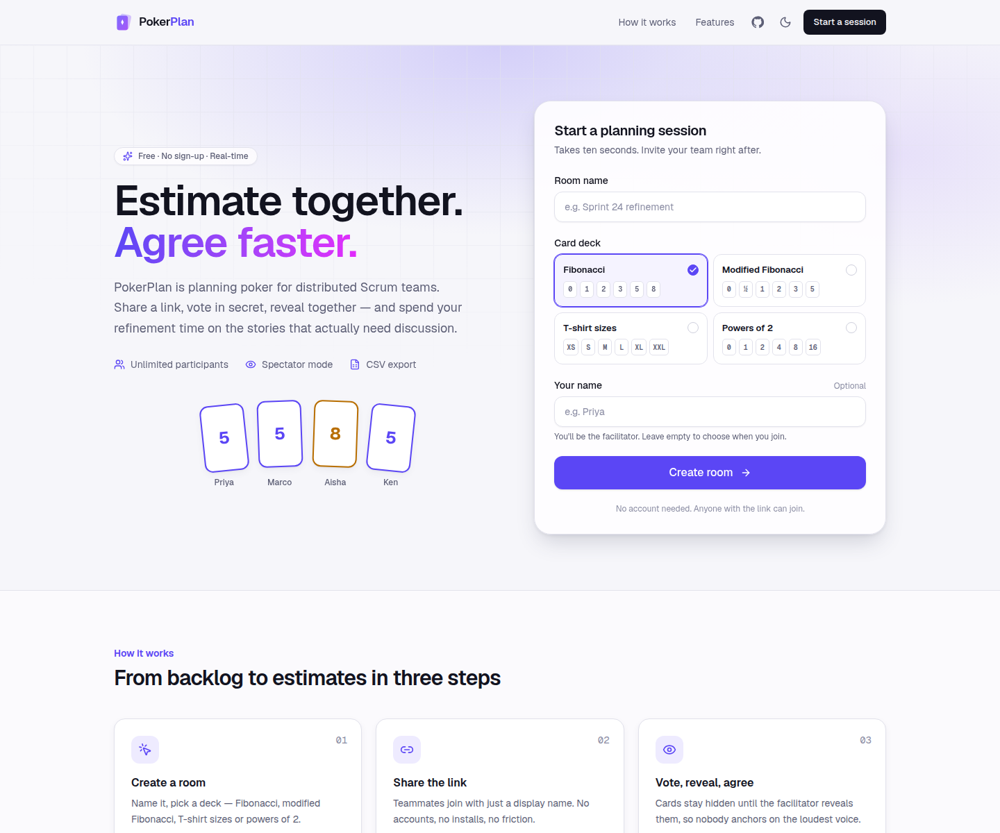      | 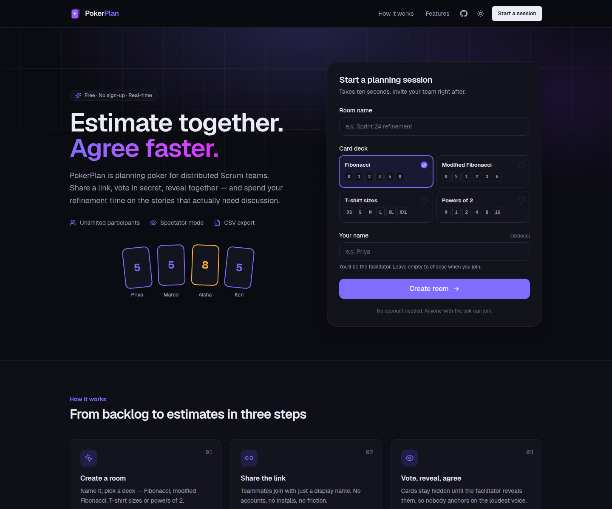 |
| **Voting in progress: your card face-up, others hidden** | **Revealed: stats, distribution, outlier, finalize**     |
| 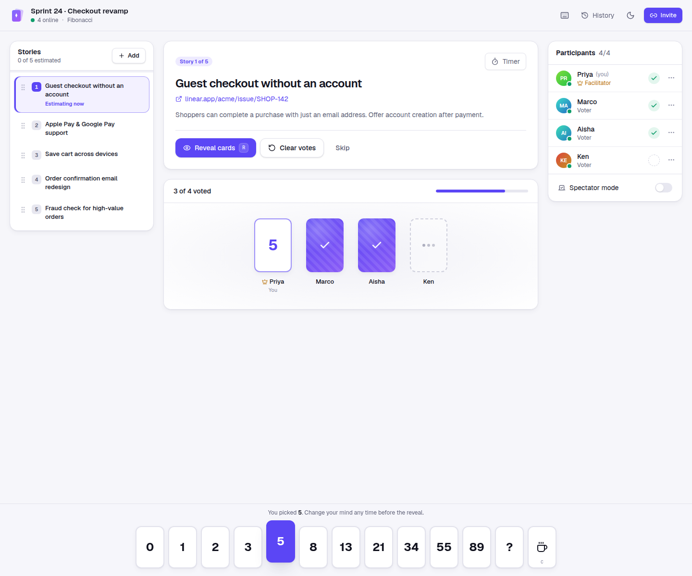                   | 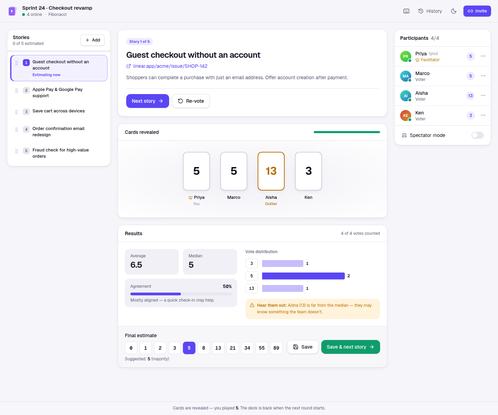         |
| **Full consensus 🎉**                                    | **Session history & CSV export**                         |
| 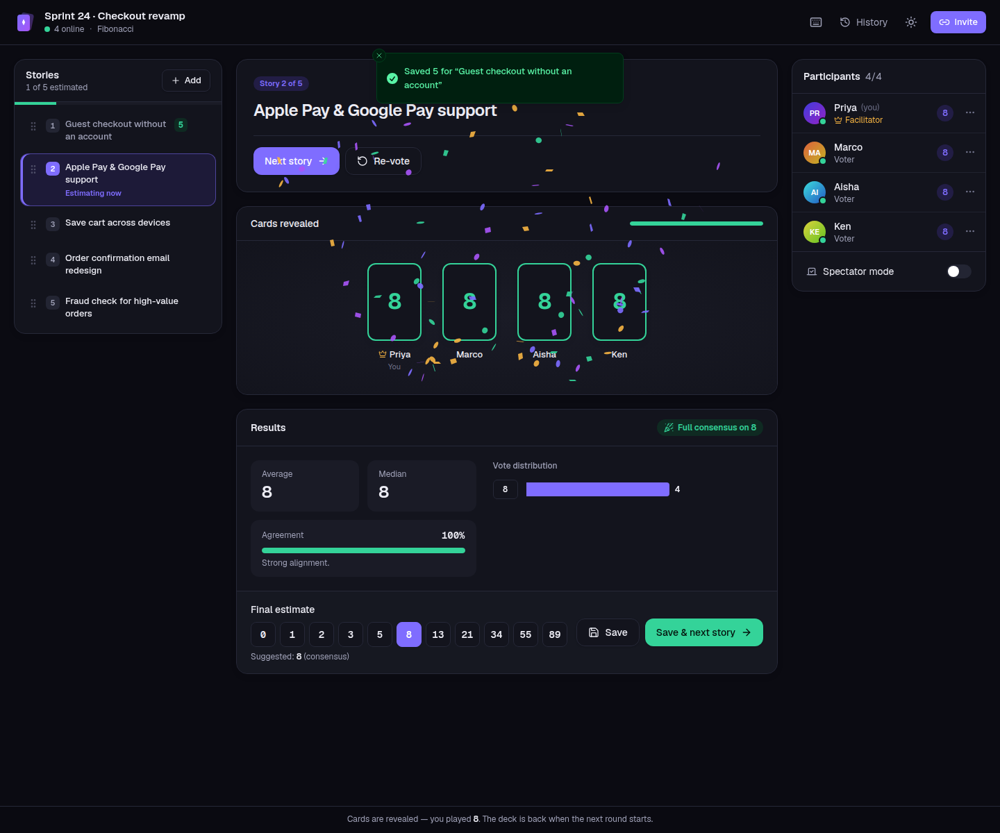             | 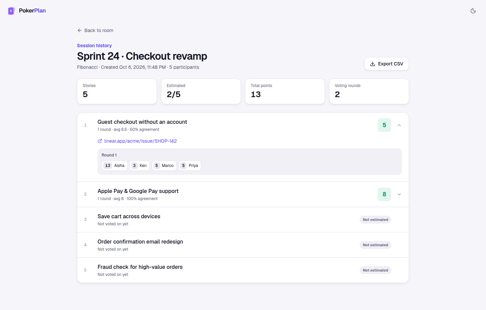                 |
| **Join via link**                                        | **Mobile**                                               |
| 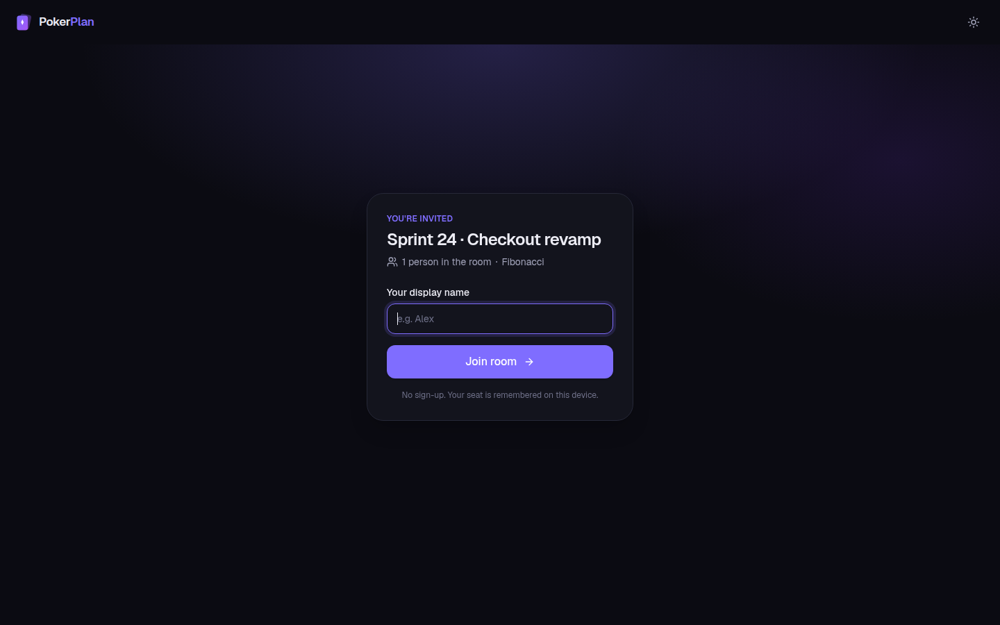                       | 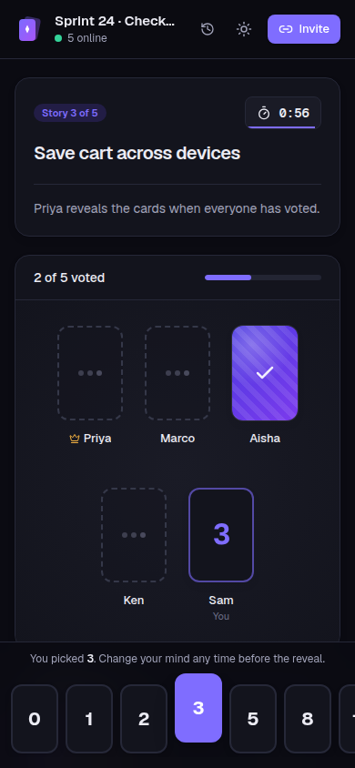    |

## Architecture

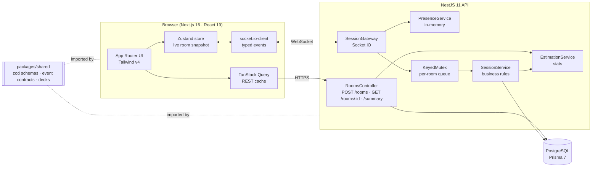

**How a vote travels:**

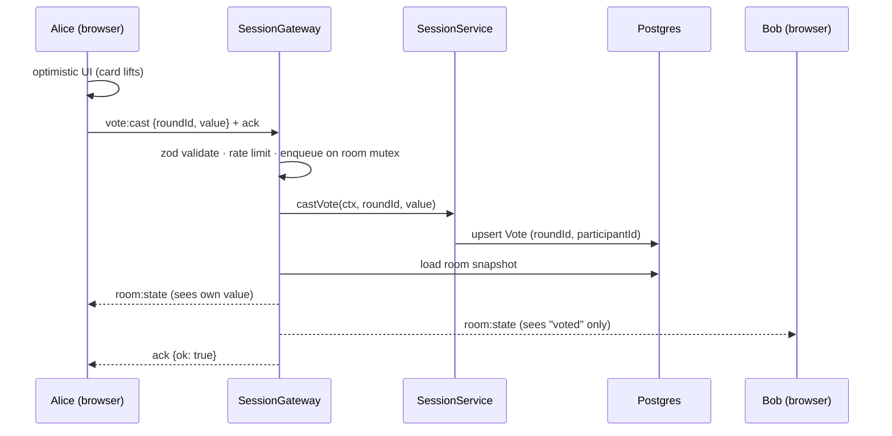

### Design decisions

- **The server is the source of truth.** Every accepted mutation is followed by a fresh, **per-viewer snapshot** (`room:state`). Clients never patch state themselves, which makes reconnection trivial: on every `connect` the client re-joins and gets the full state back. Snapshots carry a monotonic `version`, so a late packet can't roll the UI back.
- **Hidden votes are enforced server-side.** Snapshots are personalised: before reveal, other people's `vote` is `null` and only `hasVoted` is sent. Nothing leaks through DevTools.
- **Idempotent events.** Actions name the round or story they target (`roundId`, `fromStoryId`). A double-clicked "Next story" or a retried "Reveal" for a round that's no longer current is a no-op, so it can't skip a story or corrupt state. Votes are upserts on `(roundId, participantId)`.
- **Ordered mutations.** A per-room async mutex serialises "mutate → load → broadcast", so concurrent votes can never broadcast snapshots out of order.
- **Typed end to end.** `packages/shared` holds the zod schemas and the `ClientToServerEvents` / `ServerToClientEvents` maps. The same schema validates the web form, the REST body and the socket payload, and the socket.io client and server are generic over those maps.
- **Guest identity without accounts.** A random token lives in `localStorage` and is sent in the socket handshake. The DB stores `sha256(token)` with a unique `(roomId, tokenHash)` constraint, so the same browser always maps to the same seat.

### Data model

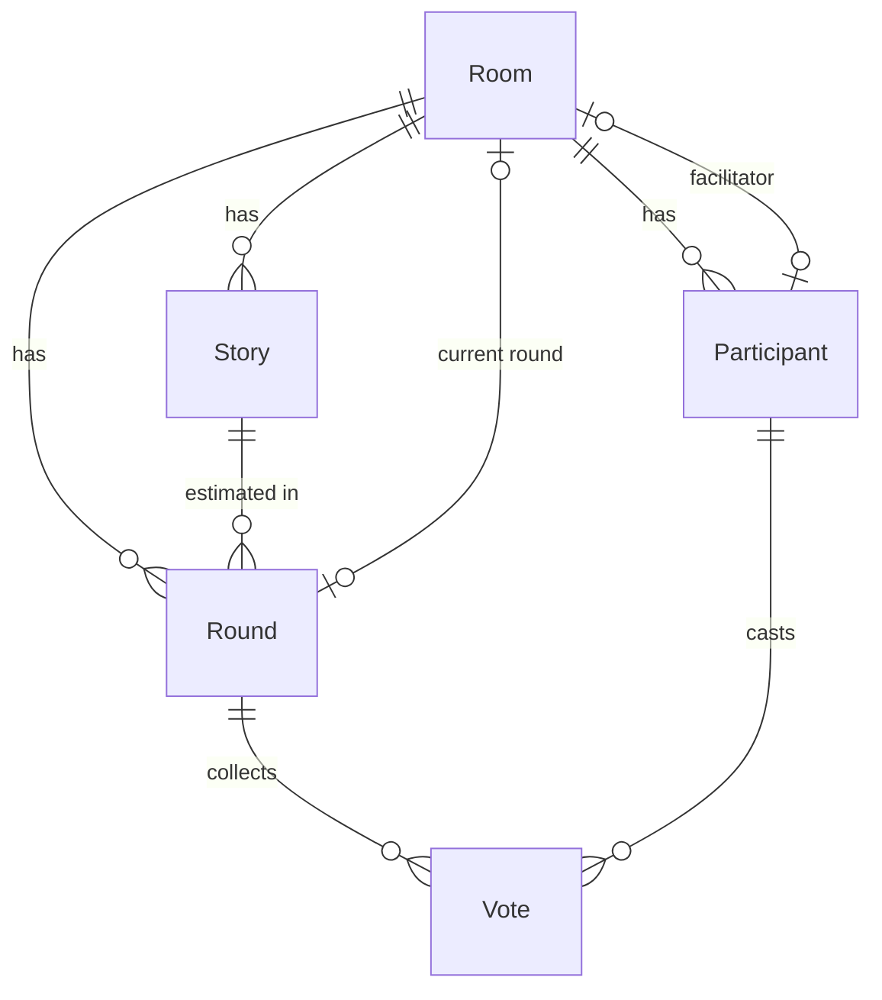

## Tech stack

| Layer    | Choices                                                                                                                                     |
| -------- | ------------------------------------------------------------------------------------------------------------------------------------------- |
| Web      | Next.js 16 (App Router, Turbopack), React 19, Tailwind CSS v4, TanStack Query 5, Zustand 5, socket.io-client, dnd-kit, sonner, lucide-react |
| API      | NestJS 11, Socket.IO 4, Prisma 7 (`prisma-client` generator + `@prisma/adapter-pg`), zod 4, nestjs-pino, @nestjs/throttler, Swagger         |
| Data     | PostgreSQL 17 (Neon in production)                                                                                                          |
| Shared   | `@pokerplan/shared`: zod schemas, DTOs, socket event contracts, deck definitions                                                            |
| Quality  | TypeScript strict (+ `noUncheckedIndexedAccess`), ESLint 9 (typed rules), Prettier, Jest 30 + Supertest + socket.io-client e2e, Vitest      |
| Delivery | Multi-stage Dockerfiles, Docker Compose, GitHub Actions, Render Blueprint, Vercel                                                           |

## Getting started

**Prerequisites:** Node.js ≥ 20.19 (24 recommended, see `.nvmrc`), npm 10+, Docker.

### Option A: everything in Docker (one command)

```bash
docker compose up --build
```

Then open <http://localhost:3100>. The API runs on <http://localhost:4100>, with Swagger at <http://localhost:4100/docs>. Migrations run automatically when the API container starts.

### Option B: local dev with hot reload

```bash
# 1. Postgres (host port 5433, so it won't clash with a local 5432)
docker run -d --name pokerplan-db -e POSTGRES_PASSWORD=postgres -e POSTGRES_DB=pokerplan -p 5433:5432 postgres:17-alpine
docker exec pokerplan-db createdb -U postgres pokerplan_test   # used by the test suite

# 2. Install (also builds packages/shared and generates the Prisma client)
npm install

# 3. Environment
cp apps/api/.env.example apps/api/.env
cp apps/web/.env.example apps/web/.env.local

# 4. Database schema
npm run db:deploy

# 5. Run shared (watch) + API + web together
npm run dev
```

- Web: <http://localhost:3100>
- API: <http://localhost:4100> · health: `/health` · docs: `/docs`

To try it with several people on one machine, open the invite link in a second browser or a private window. Each one gets its own guest identity.

### Useful scripts (repo root)

| Script                            | What it does                                                       |
| --------------------------------- | ------------------------------------------------------------------ |
| `npm run dev`                     | Shared (watch) + API (watch) + web (dev) in parallel               |
| `npm run build`                   | Production build of shared → api → web                             |
| `npm run typecheck`               | `tsc --noEmit` in every workspace                                  |
| `npm run lint`                    | ESLint in every workspace                                          |
| `npm test`                        | Vitest (shared, web) + Jest unit and e2e (api, against Postgres)   |
| `npm run format` / `format:check` | Prettier                                                           |
| `npm run db:migrate`              | `prisma migrate dev` (create a migration after editing the schema) |
| `npm run db:deploy`               | `prisma migrate deploy`                                            |

## Environment variables

### API (`apps/api/.env`)

| Variable               | Required | Default                 | Description                                                                        |
| ---------------------- | -------- | ----------------------- | ---------------------------------------------------------------------------------- |
| `DATABASE_URL`         | ✅       | none                    | Postgres connection string used by the app (Neon: the **pooled** `-pooler` host).  |
| `DIRECT_URL`           |          | `DATABASE_URL`          | Non-pooled connection string used by `prisma migrate` (Neon: the **direct** host). |
| `CORS_ORIGINS`         | ✅ prod  | `http://localhost:3100` | Comma-separated browser origins allowed for REST and WebSocket (your Vercel URL).  |
| `PORT`                 |          | `4100`                  | HTTP port (Render injects its own).                                                |
| `NODE_ENV`             |          | `development`           | `production` switches logs to JSON lines.                                          |
| `LOG_LEVEL`            |          | `info`                  | `fatal` · `error` · `warn` · `info` · `debug` · `trace` · `silent`.                |
| `FACILITATOR_GRACE_MS` |          | `30000`                 | How long the facilitator may be offline before the role is handed over.            |

The environment is validated with zod at boot, so a misconfigured deploy fails fast with a readable error.

### Web (`apps/web/.env.local`)

| Variable               | Required | Default                 | Description                                                      |
| ---------------------- | -------- | ----------------------- | ---------------------------------------------------------------- |
| `NEXT_PUBLIC_API_URL`  | ✅ prod  | `http://localhost:4100` | Public URL of the API (REST + Socket.IO). Inlined at build time. |
| `NEXT_PUBLIC_SITE_URL` |          | `http://localhost:3100` | Public URL of the web app (metadata / social previews).          |

## Testing & quality

```bash
npm test
```

| Suite                                       | Tool                    | Covers                                                                                                                                                                                                        |
| ------------------------------------------- | ----------------------- | ------------------------------------------------------------------------------------------------------------------------------------------------------------------------------------------------------------- |
| `apps/api/src/estimation/*.spec.ts`         | Jest                    | Average/median/mode, agreement, consensus rules, `?`/☕ handling, outliers, suggested estimate, ½ card, ordinal T-shirt decks                                                                                 |
| `apps/api/src/rooms/*.spec.ts`              | Jest + Postgres         | Room creation, deferred facilitator seat, token hashing, summary totals                                                                                                                                       |
| `apps/api/src/session/*.spec.ts`            | Jest + Postgres         | Idempotent join, hidden votes, vote upsert/retract, permissions, idempotent reveal and next-story, re-vote, finalize and advance, delete and reorder, spectators, removal, facilitator handover, timer expiry |
| `apps/api/test/session.gateway.e2e-spec.ts` | Jest + socket.io-client | Boots the real app on a random port: health, REST validation, handshake auth, full two-user session, reconnect resync, presence and automatic facilitator handover, removal, timer sync                       |
| `apps/web/src/lib/*.test.ts`                | Vitest                  | Keyboard shortcut resolution, CSV generation and escaping, formatting, store versioning and optimistic votes                                                                                                  |
| `packages/shared/src/*.test.ts`             | Vitest                  | Deck helpers and shared schemas                                                                                                                                                                               |

The API tests use a dedicated database (`pokerplan_test`, see `apps/api/.env.test`). `npm test` applies migrations to it first. In CI, a Postgres service container provides it.

**CI** (`.github/workflows/ci.yml`) runs format check → lint → typecheck → tests (with Postgres) → production build, then builds both Docker images.

## Deployment (Neon → Render → Vercel)

The web app goes to **Vercel**, the API (REST + WebSockets) to **Render** and Postgres to **Neon**. Each step feeds a URL into the next.

### 1. Neon (database)

1. Create a project at [neon.tech](https://neon.tech) (pick a region close to your Render region, e.g. US West (Oregon)).
2. On **Dashboard → Connect**, copy two connection strings:
   - **Pooled** (host contains `-pooler`): this becomes `DATABASE_URL`
   - **Direct** (toggle pooling off): this becomes `DIRECT_URL`
3. Keep `?sslmode=require` on both.

### 2. Render (API)

1. Push this repo to GitHub.
2. In Render, **New → Blueprint**, select the repo. Render reads [`render.yaml`](render.yaml) and creates the `pokerplan-api` web service (free plan, Node 24, health check `/health`).
3. Fill in the secret env vars when prompted:
   - `DATABASE_URL`: Neon pooled URL
   - `DIRECT_URL`: Neon direct URL
   - `CORS_ORIGINS`: leave as `http://localhost:3100` for now; you'll set the Vercel URL in step 4
4. Deploy. The start command runs `prisma migrate deploy` and then boots NestJS. Check `https://<your-service>.onrender.com/health` → `{"status":"ok",…}` and `/docs` for Swagger.

### 3. Vercel (web)

1. **Add New → Project**, import the repo.
2. Set **Root Directory** to `apps/web`. Framework: Next.js. Install and build commands come from [`apps/web/vercel.json`](apps/web/vercel.json), which installs and builds from the monorepo root.
3. Environment variables (Production + Preview):
   - `NEXT_PUBLIC_API_URL` = `https://<your-service>.onrender.com`
   - `NEXT_PUBLIC_SITE_URL` = `https://<your-project>.vercel.app`
4. Deploy.

### 4. Wire CORS back to the API

In Render → `pokerplan-api` → **Environment**, set:

```
CORS_ORIGINS=https://<your-project>.vercel.app
```

Add more origins comma-separated (e.g. a custom domain or a stable preview URL). Saving triggers a redeploy. The same allow-list applies to REST and the Socket.IO handshake.

### 5. Smoke test

Open the Vercel URL, create a room, open the invite link in a private window, vote in both, reveal and finalize, then open **History** and export CSV.

> **Alternative:** both services ship as multi-stage Docker images (`apps/api/Dockerfile`, `apps/web/Dockerfile`), so you can run them on Fly.io, Railway, ECS or Kubernetes. Pass `NEXT_PUBLIC_API_URL` as a **build arg** to the web image.

## Realtime protocol

All events are defined in [`packages/shared/src/events.ts`](packages/shared/src/events.ts). Client → server events use Socket.IO acknowledgements and resolve to `{ ok: true, data } | { ok: false, error: { code, message } }`.

| Client → server                                                 | Who         | Notes                                                                     |
| --------------------------------------------------------------- | ----------- | ------------------------------------------------------------------------- |
| `room:join {roomId, name?}`                                     | anyone      | Finds or creates the seat for the handshake token; `NAME_REQUIRED` if new |
| `room:sync`                                                     | member      | Returns a fresh snapshot                                                  |
| `vote:cast {roundId, value \| null}`                            | voter       | Upsert / retract                                                          |
| `round:reveal` / `round:reset {roundId}`                        | facilitator | No-op if the round is stale                                               |
| `round:finalize {roundId, value, advance}`                      | facilitator | Saves the estimate on the story, optionally advances                      |
| `story:next {fromStoryId}` · `story:select`                     | facilitator | Idempotent via `fromStoryId`                                              |
| `story:add` · `story:update` · `story:delete` · `story:reorder` | facilitator |                                                                           |
| `participant:spectator` · `participant:rename`                  | self        |                                                                           |
| `participant:remove` · `facilitator:transfer`                   | facilitator |                                                                           |
| `timer:start {durationSec}` · `timer:stop`                      | facilitator | Server schedules auto-reveal                                              |

| Server → client | Payload                                                            |
| --------------- | ------------------------------------------------------------------ |
| `room:state`    | Full per-viewer `RoomStateDTO` (versioned, includes `serverNow`)   |
| `room:notice`   | `{kind, message}` for toasts (handover, saved estimate, time's up) |
| `room:removed`  | You were removed by the facilitator                                |

REST endpoints (`POST /rooms`, `GET /rooms/:id`, `GET /rooms/:id/summary`, `GET /health`) are documented with Swagger at `/docs`.

## Project structure

```
pokerplan/
├── apps/
│   ├── api/                      NestJS API
│   │   ├── prisma/               schema.prisma + committed migrations
│   │   ├── src/
│   │   │   ├── common/           AppError, zod pipe, keyed mutex, id/token helpers
│   │   │   ├── config/           zod-validated env + typed config service
│   │   │   ├── estimation/       EstimationService (stats) + spec
│   │   │   ├── health/           GET /health (DB ping)
│   │   │   ├── prisma/           PrismaService (driver adapter)
│   │   │   ├── rooms/            REST controller + RoomsService + spec
│   │   │   ├── session/          Socket.IO gateway, SessionService, presence, rate limiter
│   │   │   ├── main.ts
│   │   │   └── setup-app.ts      CORS, Swagger, WS adapter, logger (shared with e2e)
│   │   ├── test/                 gateway e2e + test app factory
│   │   └── Dockerfile
│   └── web/                      Next.js app
│       ├── src/app/              routes: /, /r/[roomId], /r/[roomId]/summary
│       ├── src/components/       landing/, room/, summary/, ui/ primitives
│       ├── src/lib/              api client, socket, zustand store, actions, shortcuts, csv
│       └── Dockerfile
├── packages/shared/              zod schemas, DTO types, socket contracts, decks
├── docs/screenshots/
├── .github/workflows/ci.yml
├── docker-compose.yml
└── render.yaml
```

## Known limitations

- **Single API instance.** Presence, round timers and the per-room mutex live in memory. Scaling out would need the Socket.IO Redis adapter plus a distributed lock (e.g. Redis or Postgres advisory locks). That's the right trade-off for a free-tier deployment.
- **Guest identity is per browser.** Clearing site data or switching devices creates a new seat (offline seats can be removed by the facilitator).
- **Free-tier cold starts.** Render free services sleep after ~15 minutes idle. The web app shows a "waking up" hint while it waits.
- Rooms are not deleted automatically. A scheduled cleanup of stale rooms would be the next step for a long-running instance.

---

<div align="center">

Built by **[Lalit Kumar Rajak](https://github.com/rajak312)**, Full Stack Developer (TypeScript · React · Next.js · Node.js · NestJS).

Licensed under the [MIT License](LICENSE).

</div>
